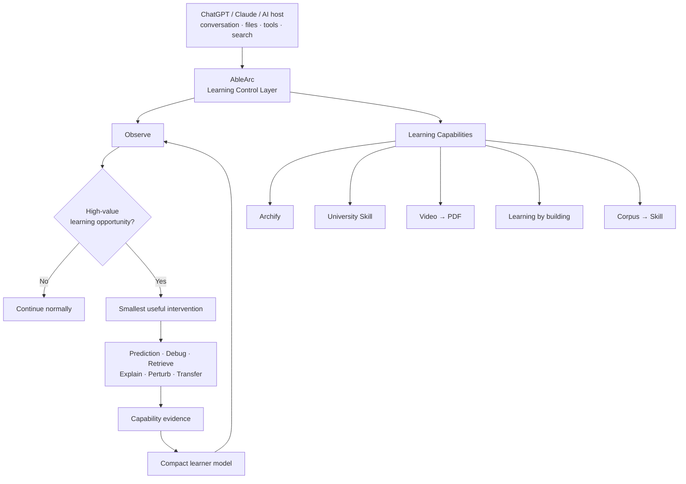

<div align="center">

# AbleArc

**A lightweight learning control layer for AI-assisted work.**

Use powerful AI without outsourcing the thinking worth keeping.

[](https://github.com/C-surfing/AbleArc/actions/workflows/ci.yml)


[Quick start](#quick-start) · [How it works](#how-it-works) · [Learning capabilities](#learning-capabilities) · [Architecture](#architecture) · [Docs](#documentation)

</div>

---

## Why AbleArc

AI makes execution dramatically cheaper. That is useful—but it also makes it easy to delegate the reasoning that builds long-term capability.

AbleArc is designed around a simple distinction:

> **Finish the work. Keep the judgment.**

It does **not** try to replace ChatGPT, Claude, or other capable AI workspaces. It sits inside them as a thin control layer that decides:

- what the AI should simply do;
- what the learner should still reason about;
- when one short intervention is worth the interruption;
- what evidence actually shows capability growth over time.

The goal is not “more tutoring”.

The goal is:

```text
high task utility
+
durable human capability
```

---

## The idea in 30 seconds

AbleArc divides work into three ownership levels:

| Level | Meaning | Typical examples |
| --- | --- | --- |
| **Core** | You should eventually be able to explain, modify, debug, and redesign it. | architecture, key algorithms, causal models, debugging strategy |
| **Review** | You should understand enough to judge whether the solution is sound. | API design, supporting modules, non-critical implementation details |
| **Delegate** | AI should just do it. | boilerplate, setup, formatting, repetitive migration, routine glue code |

Usually only **1–3 things should be Core** in one project phase.

Then AbleArc stays quiet unless a high-value learning opportunity appears.

```text
normal work
    │
    ▼
observe task + learner
    │
    ▼
worth interrupting?
   / \
 no   yes
 │     │
 │   one useful checkpoint
 │     │
 ▼     ▼
continue normally
       prediction / debug / retrieve / transfer
                     │
                     ▼
             capability evidence
```

**The most common AbleArc action is `continue normally`.**

---

## Quick start

### ChatGPT Projects — recommended

Create one project for one meaningful learning/work arc:

```text
AbleArc · CUDA
AbleArc · Grad-CAM
AbleArc · Research
AbleArc · Embedded
```

Add the relevant papers, slides, notes, code, or generated study material.

Then copy:

[`adapters/chatgpt-project/PROJECT_INSTRUCTIONS.md`](adapters/chatgpt-project/PROJECT_INSTRUCTIONS.md)

into the project's instructions.

After that, use ChatGPT normally.

Examples:

```text
推进，把环境和依赖问题直接处理。

这个 CUDA memory hierarchy 是我要掌握的。

带我学这一段论文，但不要从头重讲我已经会的部分。

这个 bug 先别直接改，检查我是不是真的知道是哪一层出问题。

这个模块交给 AI 就行。
```

No separate AbleArc UI, server, database, MCP runtime, or learning dashboard is required.

### Skill-compatible agents

Install or copy the canonical Skill directory:

```bash
cp -R skills/ablearc ~/.agents/skills/ablearc
```

Canonical policy:

[`skills/ablearc/SKILL.md`](skills/ablearc/SKILL.md)

### Other AI hosts

Use the portable prompt adapter:

[`adapters/generic/SYSTEM_PROMPT.md`](adapters/generic/SYSTEM_PROMPT.md)

---

## How it works

AbleArc has three first-class responsibilities.

### 1. Longitudinal learner model

Track what the learner can actually do—not what they have merely seen.

Useful evidence includes:

- independent explanation;
- prediction before feedback;
- debugging hypotheses;
- modification and application;
- changed-context transfer;
- delayed retrieval;
- the amount of scaffolding required.

A transcript answers:

> What happened?

A learner model answers:

> What do those events imply about capability?

AbleArc keeps those two concepts separate.

### 2. Learning opportunity detection

Not every task deserves friction.

AbleArc should intervene when reasoning has compounding value:

- architecture and module boundaries;
- state/data-flow design;
- performance bottlenecks;
- important causal models;
- debugging strategy;
- consequential algorithm choices;
- research hypotheses;
- transfer to a changed constraint.

It should usually **not** intervene for:

- dependency installation;
- boilerplate;
- formatting;
- routine API wiring;
- repetitive migration;
- simple syntax fixes;
- low-value environment problems.

See [`learning-opportunities.md`](skills/ablearc/references/learning-opportunities.md).

### 3. Capability evidence & trajectory

AbleArc does not use “I understand” as proof of mastery.

A useful rough progression is:

```text
recognition
  → recall
  → explanation
  → application
  → transfer
```

And access can become progressively stronger:

```text
guided
  → independent
  → changed-context transfer
  → delayed / durable retrieval
```

The point is not to manufacture a score.

The point is to make the **next learning decision** more accurate.

---

## High-value intervention primitives

AbleArc uses these selectively—not as a mandatory tutoring script.

| Primitive | Use it when |
| --- | --- |
| **Prediction → Feedback** | A forecast will expose the learner's causal model before the answer is revealed |
| **Hypothesis → Experiment → Observation → Update** | Debugging itself is worth learning |
| **Feynman / teach-back** | A Core concept needs model-level verification |
| **Perturbation** | You want to know whether understanding survives changed constraints |
| **Transfer** | The same mental model should work in a new context |
| **Delayed retrieval** | Durability matters more than immediate fluency |
| **Knowledge extraction** | A meaningful project phase has completed |
| **Understanding-debt check** | AI has modified the same area repeatedly and ownership is becoming unclear |

The rule is simple:

> Prefer **one high-information checkpoint** over many small questions.

---

## Learning capabilities

AbleArc does not reimplement every study or artifact workflow.

It routes to specialized capabilities only when they are better than an inline answer.

| Capability | Best use |
| --- | --- |
| [Archify](https://github.com/tt-a1i/archify) | architecture, mechanisms, data flow, lifecycle, sequence, bounded learning maps |
| [University Skill](https://github.com/walkinglabs/university-skill) | substantial topic-first textbook / coursebook material |
| [wdkns-skills](https://github.com/wdkns/wdkns-skills) · `youtube-render-pdf` | turn a YouTube lecture into durable structured study material |
| [wdkns-skills](https://github.com/wdkns/wdkns-skills) · `bilibili-render-pdf` | Bilibili-oriented source-faithful lecture notes / PDF |
| [skills-for-learning](https://github.com/iannbing/skills-for-learning) | programming learning-by-building with meaningful milestones and progressive hints |
| [corpus-to-skill](https://github.com/nicholasswhite/corpus-to-skill) | reusable knowledge context from a substantial stable corpus |
| Research / search | current facts, source verification, paper and resource comparison |
| Code execution | runtime experiments, prediction tests, debugging evidence |
| Document / PDF tooling | package material after its learning purpose is clear |

> **Artifact ≠ capability.**

A polished PDF, diagram, passing test suite, or completed project does not prove that the learner can explain, debug, modify, or transfer the underlying model.

Detailed routing policy:

[`skills/ablearc/references/companion-skills.md`](skills/ablearc/references/companion-skills.md)

---

## Architecture



The host owns the interaction surface.

AbleArc owns **learning judgment + longitudinal capability**.

Specialized tools own artifact generation.

---

## Optional learner state

AbleArc works without explicit persistence.

When host history alone is not enough, use:

[`skills/ablearc/templates/learning-state.md`](skills/ablearc/templates/learning-state.md)

A compact state may contain:

```text
Mission
Ownership / Core
Current frontier
Learner model
Decisive evidence
Understanding debt
Review / transfer candidates
Active source context
Next useful opportunity
```

It should **not** become a transcript, second brain, generic task tracker, or mastery database.

---

## Explicit modes

AbleArc responds to a few natural interaction modes.

| You say | AbleArc behavior |
| --- | --- |
| **推进 / 直接做 / 先完成** | prioritize delivery; minimize interruption |
| **带我学** | increase learner action, prediction, explanation, and practice |
| **复盘** | stop implementation and extract durable knowledge |
| **检查我是不是真的懂** | verify with explanation, prediction, debugging, comparison, or transfer |
| **这个交给 AI** | treat it as Delegate |
| **这是我要掌握的** | treat it as Core and raise the evidence bar |

No special command syntax is required.

---

## Research direction

AbleArc is increasingly less about “how to make an AI tutor explain better”.

Strong foundation models are already good at local explanation.

The harder problem is longitudinal:

> **How can AI increase task productivity without decreasing long-term human capability?**

A useful conceptual objective is:

```text
Task Utility + λ · Δ Human Capability
```

This naturally connects AbleArc to:

- longitudinal memory;
- context compression;
- learner modeling;
- intervention policy;
- scaffold dependence;
- understanding debt;
- retrieval scheduling;
- transfer;
- human–agent delegation boundaries.

See [ADR 0013](docs/adr/0013-learning-control-layer.md).

---

## Repository layout

```text
AbleArc/
├── skills/
│   └── ablearc/
│       ├── SKILL.md
│       ├── references/
│       └── templates/
│
├── adapters/
│   ├── chatgpt-project/
│   └── generic/
│
├── evaluation/
├── tests/
├── docs/
└── prompts/
```

The repository intentionally avoids a first-party Web app, custom runtime, database, provider layer, or generic agent framework.

---

## Design principles

1. **Normal AI use is the default.**
2. **Preserve judgment, not mechanical labor.**
3. **Keep Core ownership small.**
4. **Evidence beats confidence.**
5. **A generated artifact is not learning.**
6. **Host capabilities should be reused, not rebuilt.**
7. **Stronger models should make AbleArc thinner, not larger.**
8. **Add infrastructure only after repeated real learning failures justify it.**

---

## Documentation

- [Using AbleArc](docs/USAGE.md)
- [Architecture](docs/SKILL-FIRST-ARCHITECTURE.md)
- [Current roadmap](ROADMAP.md)
- [ADR 0013 — Learning control layer](docs/adr/0013-learning-control-layer.md)
- [Behavior scenarios](tests/SKILL-BEHAVIOR.md)
- [Dogfooding runbook](evaluation/RUNBOOK.md)
- [Learning capability routing](skills/ablearc/references/companion-skills.md)
- [Learning opportunity detection](skills/ablearc/references/learning-opportunities.md)

---

<div align="center">

**AbleArc**

*Delegate execution. Preserve judgment. Build mental models. Accumulate capability.*

</div>
